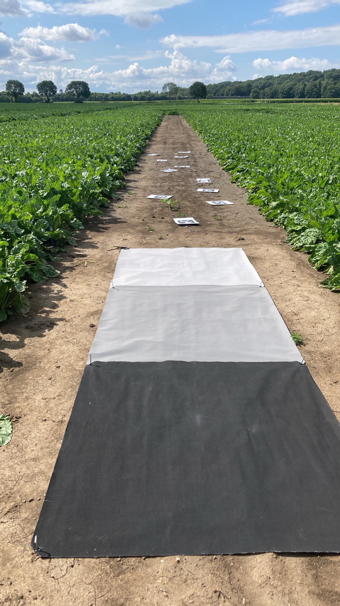

<br />
<p align="center">
<a></a>
</p>
<h3 align="center">ReflectDetect</h3>
<p align="center">    An automated workflow for in-flight radiometric calibration of UAV imagery<br /></p>
<p align="center">
  <a href="https://github.com/reflectdetect/reflectdetect/blob/main/LICENSE"></a>
  <a href="https://github.com/reflectdetect/reflectdetect/network/members"></a>
  <a href="https://github.com/reflectdetect/reflectdetect/stargazers"></a>
</p>
<p>
<a href="https://github.com/reflectdetect/reflectdetect/issues">Report Bug</a>
·
<a href="https://github.com/reflectdetect/reflectdetect/issues">Request Feature</a>
</p>
<a href="https://reflectdetect.readthedocs.io">Documentation</a>

## Overview

This is the official repository for the paper "Application Note: An automated workflow for in-flight radiometric
calibration of UAV imagery"

- TODO Properly cite paper

### Abstract

> UAVs equipped with optical sensors have transformed remote sensing in vegetation science
> by providing high-resolution, on-demand data, enhancing studies in forestry,
> agriculture, and environmental monitoring.
> However, accurate radiometric calibration of UAV imagery remains challenging due to environmental variability
> and the limitations of existing methods, such as the common single gray reference panel, which is prone to errors.
> ReflectDetect, an open-source tool, addresses these challenges
> by automating radiometric calibration using geotagging and AprilTag detection.
> This dual-module approach ensures reliable calibration under varying conditions, reduces human error, and increases
> efficiency through a user-friendly CLI.
> ReflectDetect's modular design supports future enhancements and broader applicability across research fields.

- TODO Explain both approaches and add images

> [!NOTE]
> We provide two workflows. We summarize the two workflows here, for a detailed look at the technical details make
> sure to follow the upcoming `setup` and `usage` sections for your preferred workflow.

### :artificial_satellite: Geolocation

1. Collect panel reflectance values for the bands you want to capture from the manufacturer (for commercial panels) or
   using a field spectrometer (for DIY panels) and save the values to a `panel_properties.json` file
2. Place panels in the field
3. Capture the location of the panel corners (we used a (TODO: Add device name) in our testing) and save them to
   a `panel_locations.gpkg` file
4. Fly your remote sensing mission and save captured images
5. Convert the images to orthophotos by rectifying and geo-referencing them. (We used (TODO: Add software name) in our
   testing)
6. Run reflectdetect on the orthophotos to convert them to reflectance data

### :white_square_button: Apriltags

1. Collect panel reflectance values for the bands you want to capture from the manufacturer (for commercial panels) or
   using a field spectrometer (for DIY panels) and save the values to a `panel_properties.json` file
2. Print out an apriltag for each panel (pdf files for printing are available in our github repository
   under `/apriltag_printouts/`) TODO: add pdf files
3. Place panels in the field
4. Place the apriltags according to the placement guide (TODO: Link Placement guide)
5. Fly your remote sensing mission and save captured images
6. Run reflectdetect on the images to convert them to reflectance data

### Vocabulary

#### Panel

Panel refers to the calibration sheets that will be placed in the field. They allow us to compare their intensity value
captured in the image to the known reflectance supplied in the `panel_properties.json` file.

TODO: add good image of panels



#### Apriltag / Tag

Apriltag

- Primary detection area vs total area

#### Field

the area the drone images capture

#### Image

Reflectdetect currently assumes that all the images were taken at equal time intervals
images are one band at a time
images are assumed to be named "*_{band_index}.tif"
we use the regec
so for examalpe IMG_0052_6.tif -> 6
regexr.com/857r5

#### Orthophoto / Photo

orthophotos are all bands in one


## Table of Contents

<!-- TOC -->
  * [Overview](#overview)
    * [Abstract](#abstract)
    * [:artificial_satellite: Geolocation](#artificial_satellite-geolocation)
    * [:white_square_button: Apriltags](#white_square_button-apriltags)
    * [Vocabulary](#vocabulary)
      * [Panel](#panel)
      * [Tag](#tag)
      * [Field](#field)
      * [Image](#image)
      * [Orthophoto / Photo](#orthophoto--photo)
  * [Table of Contents](#table-of-contents)
  * [Installation](#installation)
* [:white_square_button: Apriltags](#white_square_button-apriltags-1)
  * [:white_square_button: Setup](#white_square_button-setup)
    * [:white_square_button: Create a panel_properties.json file](#white_square_button-create-a-panel_propertiesjson-file)
    * [:white_square_button: Create dataset folder](#white_square_button-create-dataset-folder)
  * [:white_square_button: Usage](#white_square_button-usage)
* [:artificial_satellite: Geolocation](#artificial_satellite-geolocation-1)
  * [:artificial_satellite: Setup](#artificial_satellite-setup)
    * [:artificial_satellite: Create a panel_properties.json file](#artificial_satellite-create-a-panel_propertiesjson-file)
    * [:artificial_satellite: Create dataset folder](#artificial_satellite-create-dataset-folder)
  * [:artificial_satellite: Usage](#artificial_satellite-usage)
* [Planned Features](#planned-features)
* [Contributing](#contributing)
* [References](#references)
* [License](#license)
<!-- TOC -->

## Installation

TODO: Install python

TODO: install exiftool

```
pip install reflectdetect
```

# :white_square_button: Apriltags

## :white_square_button: Setup

### Create a panel_properties.json file

To give access to the information about your calibration panels, create a `panel_properties.json` file. It
includes the reflectance values of each panel for each of the bands you captured.
The following example shows how two panels might be configured. All the information about the first panel is
between the first `{ }` and so on.

The tag id has to correspond to the id of the apriltag you placed next to the given panel. No id can be used twice!

```json
[
  {
    "tag_id": 1,
    "bands": [
      0.9,
      1.0,
      1.0,
      1.0,
      0.72,
      0.91
    ]
  },
  {
    "tag_id": 2,
    "bands": [
      0.9,
      1.0,
      0.43,
      0.70,
      0.35,
      0.4
    ]
  }
]
```

### Create dataset folder

In order for reflect-detect to be able to gather the necessary information about the images, panels, camera, etc. ,
reflect-detect expects you to structure your data in the following format:

```
dataset_folder
│   panels_properties.json
│   
└───images
│   │   IMG_0000_1.tif
│   │   IMG_0000_2.tif
│   │   IMG_0001_1.tif
│   │   IMG_0001_2.tif
|   |   ...
```

> [!TIP]
> If any of the folders/files are located elsewhere, you can specify their location using the `--panel_properties_file`
> or `--images_folder` argument


## :white_square_button: Usage

```bash
python .\reflectdetect\apriltag_main.py --family "tag25h9" --panel_properties_file data/apriltags_run2/panel_properties.json --images_folder data/apriltags_run2/0001SET/000 ".\data\apriltags_run2\0001SET\000\" -d
```

# :artificial_satellite: Geolocation

## :artificial_satellite: Setup

### Create a panel_properties.json file

To access the information about your calibration panels, we need you to create a `panel_properties.json` file. It
includes the reflectance values of each panel for each of the bands you captured.
In the following example we show how two panels might be configured. All the information about the first panel is
between the first `{ }` and so on.

We assume that the first panel in the file corresponds to the first layer of coordinates in the geopackage file (TODO:
explain better)

```json filename="panel_properties.json"
[
  {
    "layer_name": "corner_27",
    "bands": [
      0.9,
      1.0,
      1.0,
      1.0,
      0.72,
      0.91
    ]
  },
  {
    "layer_name": "corner_28",
    "bands": [
      0.9,
      1.0,
      0.43,
      0.70,
      0.35,
      0.4
    ]
  }
]
````

###  Create dataset folder

In order for reflect-detect to be able to gather the necessary information about the images, panels, camera, etc. ,
reflect-detect expects you to structure your data in the following format:

```
dataset_folder
│   panels_properties.json
│   panel_locations.gpkg
│
└───orthophotos
│   │   IMG_0000.tif
│   │   IMG_0001.tif
│   │   IMG_0002.tif
│   │   IMG_0003.tif
|   |   ...
```

## :artificial_satellite: Usage

# Planned Features
- [] Support for unequal time intervals between images
- [] Customize parameters on a per panel basis
# Contributing
# References
# License